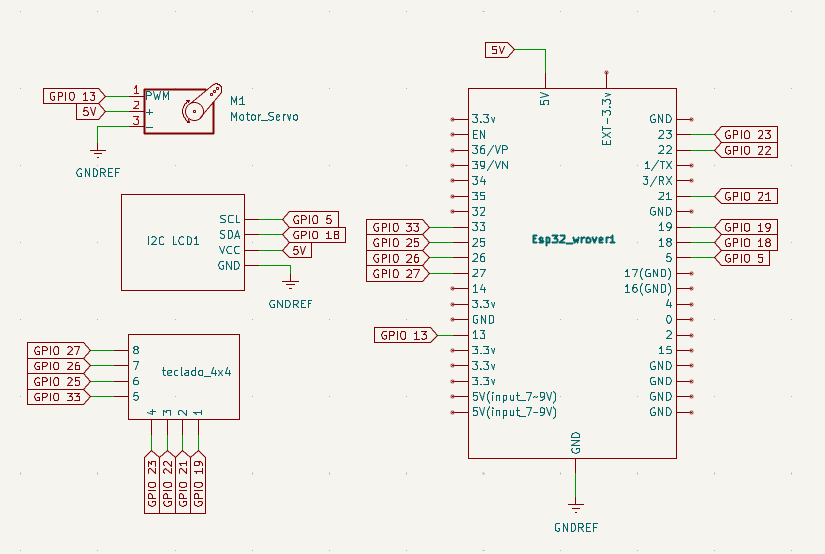

# Portão com Senha
## Descrição
Um servo para simular a abertura de um portão que é destravado com a senha digitada em um teclado 4x4, o projeto também tem um display para mostrar a senha digita, alterar a senha ou mostrar que a senha está errada.
O intuito principal do projeto é primeiramente praticar a documentação de projetos eletrônicos e também estimular o desenvolvemento mesmo que simples.
## Funcionalidades
- Controle de acesso mediante senha
- Alteração da senha
- Display com "Menu"

## Hardware
| Componente | Quantidade |
|---|---:|
| ESP32-WROVER | 1 |
| Servo Motor | 1 |
| Módulo Display LCD1602 | 1 |
| Teclado matricial 4x4 | 1 |
| Protoboard | 1 |
| Jumpers | vários |

## Esquemático

  

## Resultados

  

